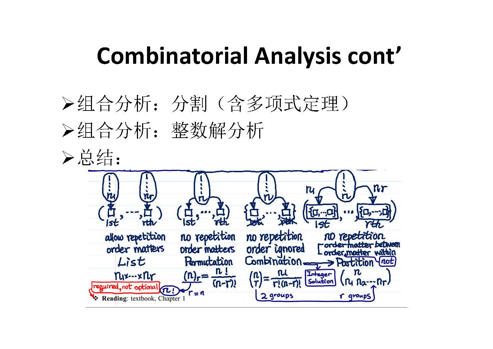

【[Home](https://simplelp.github.io/) | [GitHub](https://github.com/SimpleLP/ProbabilityAndMathematicalStatistics)】     
本系列文章归纳整理概率论与数理统计的内容

-------------------------------------------------------------

# 概率论
## 1. 概率论简介
提纲 
  
PDF笔记：[概率论简介](01_Introduction_0913.pdf)     

## 2. 组合分析(a)
提纲 
  
PDF笔记：[组合分析(a)](02_Combinatorics_0915.pdf)    

## 3. 组合分析(b)
提纲 
  
PDF笔记：[组合分析(b)](02_Combinatorics_0920.pdf)

---------------------------------------------------------

# 参考资料
[概率论](http://www.stat.nthu.edu.tw/~swcheng/Teaching/math2810/index.html), 国立清华大学郑少为老师        
[统计学](http://www.stat.nthu.edu.tw/~swcheng/Teaching/math2820/index.html), 国立清华大学郑少为老师        
[数理统计](http://www.stat.nthu.edu.tw/~swcheng/Teaching/stat3875/index.php), 国立清华大学郑少为老师         
[数理统计与数据分析](http://dase.ecnu.edu.cn/mgao/teaching/UStat_2018_Fall/MSDA.html)， 华东师范大学高明老师           
"Mathematical Statistics and Data Analysis", JohnA.Rice著          
"Statistical Inference"，Casella G.著         
《概率论与数理统计》，茆诗松等著        
[概率论与数理统计](https://www.bilibili.com/video/av17582696?from=search&seid=10229922130523106701)，中科大缪柏其教授    
