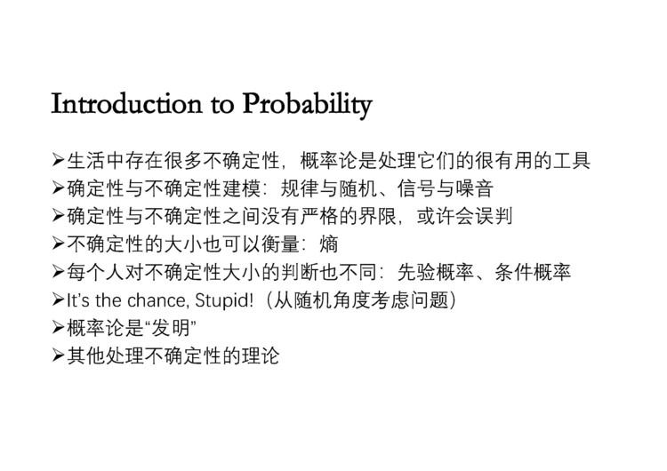
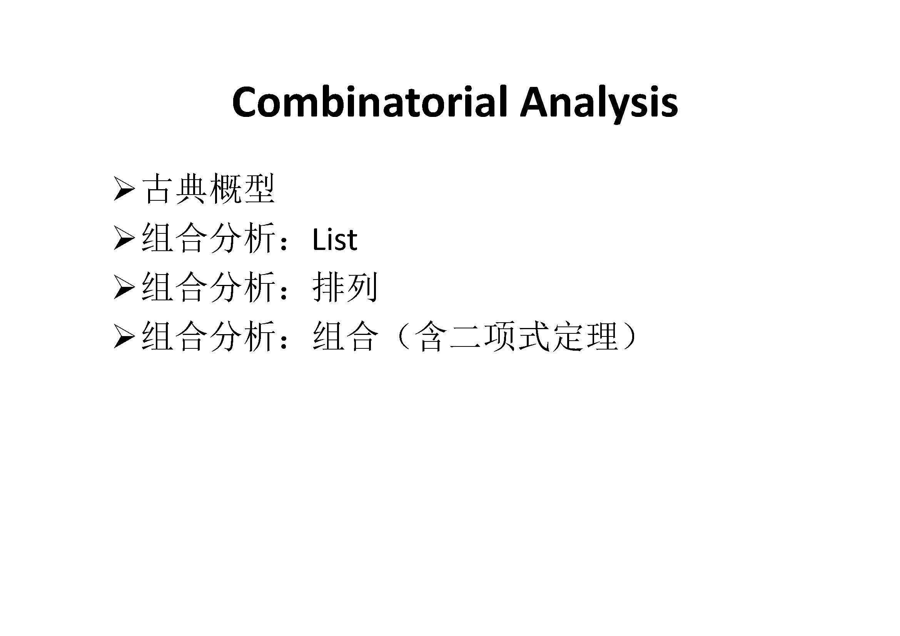

[GitHub](https://github.com/SimpleLP/ProbabilityAndMathematicalStatistics)     
本系列文章归纳整理概率论与数理统计的内容

-------------------------------------------------------------

# 概率论
## 1. 概率论简介
提纲 
      
PDF笔记：[概率论简介](01_Introduction_0913.pdf)     

## 2. 组合分析(a)
提纲 
     
PDF笔记：[组合分析(a)](02_Combinatorics_0915.pdf)   

---------------------------------------------------------

# 参考资料
[概率论---郑少为](http://www.stat.nthu.edu.tw/~swcheng/Teaching/math2810/index.html)       
[统计学---郑少为](http://www.stat.nthu.edu.tw/~swcheng/Teaching/math2820/index.html)      
[数理统计---郑少为](http://www.stat.nthu.edu.tw/~swcheng/Teaching/stat3875/index.php)       
[数理统计与数据分析---高明](http://dase.ecnu.edu.cn/mgao/teaching/UStat_2018_Fall/MSDA.html)      
